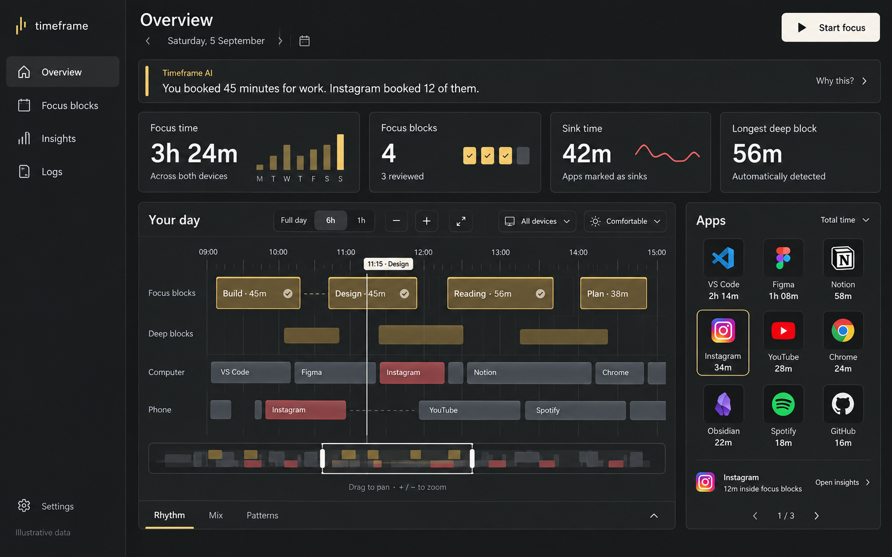

# Timeframe: visual implementation contract

Version 5.3 · 6 September 2026 · Read this before changing UI source

## 0. What the owner is asking you to fix

The previous implementation did not resemble the approved visual concept. This task is to reproduce a specific visual composition and its interactions, not reinterpret a prose brief into a generic dashboard. The owner wants reference reconstruction, not a fresh design inspired by it. Always supply the included PNG directly to the coding agent as an image as well as a file; prose is not a replacement for visual input. If the agent cannot inspect images or its rendered output, it must explicitly report that it cannot verify the requested fidelity.

This file is the **single UI implementation authority**. It replaces the presentation instructions in `TIMEFRAME-UI-REDESIGN.md`, `update.md`, `brief/UI.md`, generated multi-screen boards, and older master-spec UI sections. Preserve existing engineering, privacy and verified calculation rules unless this file explicitly changes user-facing behavior. Historical analytics documents may explain background, but must not restore removed UI or override this file's disclosure rules.

The owner authorizes the design decisions here. Do not pause for another palette, radius or layout approval. Inspect and repair the actual app. Do not scaffold over an existing project, reset its lockfile, replace its framework, delete user data, or invent backend integrations.

**The attached image `reference/approved-overview.png` is the primary visual reference. Open it at native resolution before editing.** It is the full-size dashboard the owner liked. Other generated boards are not competing visual references.



The image is a raster concept with illustrative data. Follow its overall composition, typography hierarchy, app grid, large timeline and restrained amber surfaces. Do not copy arbitrary values, implied formulas, chart geometry, or decorative artifacts as implementation truth.

### Approved differences from the reference image

Only these deliberate differences should be introduced while reproducing the base composition:

1. Remove the bottom **Rhythm / Mix / Patterns** strip completely. No replacement tab strip.
2. Put the rhythm preview inside Focus time; its detail opens a sheet. Add one slim Time mix row under metrics. Patterns live in the AI observation, App lens and Insights.
3. Make recurring labels at least 14px and secondary metadata at least 13px. Do not reproduce tiny text.
4. Retain friendly app icons/names; the small Instagram teaser under the grid is optional and omitted in the baseline layout to avoid duplicate detail.
5. Use actual safe values and correct labels; the image's event positions and numbers are illustrative.
6. Primary buttons are off-white as shown. Amber belongs mainly to focus data. Do not take gold buttons or timer rings from later boards as a design change.

**Do not shrink focus ribbons into two thin device strips.** The approved timeline has four distinct lanes: intentional blocks, detected runs, computer, phone.

## Complete visual reference set: all 16 screen states

The four original boards are included unchanged, with four screen states per image. They are not 16 separate full-resolution exports. Read each panel at native resolution; do not infer production font sizes from the reduced collage. The additional full-size `reference/approved-overview.png` remains the shared style and Overview geometry anchor. All 16 states below are in scope; the primary reference does not mean only Overview should be implemented.

| Screen | State | Original board | Position |
| --- | --- | --- | --- |
| 01 | Overview | [Open board](reference/boards/01-overview-and-details.png) | Top left |
| 02 | App lens | [Open board](reference/boards/01-overview-and-details.png) | Top right |
| 03 | Explain a metric | [Open board](reference/boards/01-overview-and-details.png) | Bottom left |
| 04 | Time mix detail | [Open board](reference/boards/01-overview-and-details.png) | Bottom right |
| 05 | Focus block list | [Open board](reference/boards/02-focus-blocks.png) | Top left |
| 06 | Start a block | [Open board](reference/boards/02-focus-blocks.png) | Top right |
| 07 | Active focus | [Open board](reference/boards/02-focus-blocks.png) | Bottom left |
| 08 | Review block | [Open board](reference/boards/02-focus-blocks.png) | Bottom right |
| 09 | Insights patterns | [Open board](reference/boards/03-insights-and-analyzer.png) | Top left |
| 10 | Compare periods | [Open board](reference/boards/03-insights-and-analyzer.png) | Top right |
| 11 | Custom AI Analyzer | [Open board](reference/boards/03-insights-and-analyzer.png) | Bottom left |
| 12 | Analyzer evidence | [Open board](reference/boards/03-insights-and-analyzer.png) | Bottom right |
| 13 | Logs activity | [Open board](reference/boards/04-logs-and-settings.png) | Top left |
| 14 | Logs changes | [Open board](reference/boards/04-logs-and-settings.png) | Top right |
| 15 | Settings appearance and AI | [Open board](reference/boards/04-logs-and-settings.png) | Bottom left |
| 16 | Settings devices and data | [Open board](reference/boards/04-logs-and-settings.png) | Bottom right |

### How to reconcile the references

Use each board for its screen's content hierarchy, action placement, forms, charts and detail relationships. Apply the same global tokens, legible type sizes, off-white primary controls and substantial horizontal timeline from this contract across all screens. The exceptions already listed above remain explicit: replace the collage's narrow two-lane Overview timeline with four substantial lanes, and the active timer ring with the horizontal focus display. These are specific corrections, not permission to redesign the remaining screens. No screen may be omitted simply because it lacks a standalone image.

Treat all sample numbers, dates, chart paths, status messages and privacy claims as illustrative. Compute actual values and only claim behavior that is implemented. In particular, never recreate the pictured charts using fixed arrays in the normal app. Keep the on-demand Analyzer within Insights, rather than expanding the Overview into a long page. Internal Insights/Logs views in these boards do not authorize restoring the removed dashboard Rhythm/Mix/Patterns strip.

For visual QA, capture each of these 16 states in the real web app, identify its board and panel, and list only intentional differences. Match the parent screen's selected date/filter behind an overlay. Inspect dialog focus, dismiss and return behavior as well as its appearance. Original board filenames are stable and should be passed to the coding agent as actual images alongside this document.

## 1. Start in the real repository

Before editing, inspect: repository guidance, web package/lockfile, global styles, root layout, current Overview route, installed shadcn primitives, fonts/icons, timeline implementation, adapters/ViewModels, and Android modules if native is in scope. Capture the current Overview at 1440×900. Write a short actual-file mapping into the implementation notes. Do not ask the owner to choose dependencies.

The supplied historical spec identifies Next.js App Router + TypeScript + Tailwind + shadcn for web, and Kotlin/Compose for Android. The current checked-out manifests are authoritative about installed versions. Missing actual source is a concrete blocker: report it rather than claiming you changed the app from a ZIP of Markdown.

### Repository audit and mandatory repair map — 6 September 2026

Repository: https://github.com/amandeep4324234/time-agent-app-build-gemini

Inspected revision: `e60f2e66eaaa8a12afb59af90f9bd00b2ef1d638` on `master`. This is a source inspection, not a browser, build, deployment, Android or full analytics audit. Recheck these findings against your checkout before editing. Do not blindly reset to this revision.

UI source did change. The preceding UI commit `6535f06232706d867190e0e300b616099d1adec4` explicitly describes reproducing a 16-panel collage. That collage is not the primary reference defined above. Commit descriptions claiming pixel-perfect results or passing tests are not visual acceptance evidence. The source contains both newer graphite styling and older design decisions. Whether the owner's viewed deployment contains these commits remains unverified.

All paths below are relative to the repository root. These are existing files, not proposed replacements. Edit the active components in place and preserve their verified behaviors.

| Priority / existing file | Observed source issue | Required concrete repair |
| --- | --- | --- |
| P0 `AGENT.md` | Directs the agent to older visual documents using local Windows file URLs. | Place this handoff and its reference under `docs/ui/`; replace obsolete UI precedence links with relative links to `docs/ui/START-HERE.md`. Keep valid non-UI engineering rules. Make one primary image authoritative. |
| P0 `web/src/components/overview/MetricCards.tsx` | Focus-block value falls back to string `4` when completedCount is zero. Three charts use literal arrays; Focus time fills missing earlier values with `1.5` and enforces a minimum 15% bar height. Weekday labels are fixed Monday–Sunday. | Remove fabricated production values. Display actual zero as `0`, absent data as `—`, and chart gaps for unknown observations. Derive each series from the same effective ledger, date range, timezone and revision as its headline. Compute actual day labels. Zero must have zero quantitative height; a separate baseline marker may indicate an observed zero. Scale bars from a disclosed consistent domain without silently clipping large values. |
| P0 `web/src/app/(product)/app/page.tsx` | Overview builds its ledger from imported `data/demo-sessions.json`; timezone is fixed to Asia/Kolkata. Today navigation targets the latest demo day. | Preserve fixtures for an explicitly labeled Demo mode. Trace and use the existing real data source for normal mode. If no integration exists, report that blocker and show a truthful disconnected/empty state; do not invent an endpoint. Use the user's analysis timezone and actual local calendar date for Today outside demo mode. |
| P1 `web/src/app/layout.tsx` | Body applies old hardcoded colors and `font-mono`, overriding the intended inherited Inter font. | Use the shared theme background/text tokens and `font-sans` on the body. Keep `font-mono` only on quantities, timestamps and technical identifiers. Verify computed font on a navigation label and card title. |
| P1 `web/src/app/globals.css` | Purple focus ribbon/AI glow remains; card shadow remains. Duplicate `--border-strong` later overrides the earlier value. | Collapse to one definition per token. Replace focus ribbon rules with amber token-based styles. Remove purple radial glow and card drop shadows. Match the CSS contract below and inspect actual computed styles. |
| P1 `web/src/app/(product)/layout.tsx` | Desktop main uses `xl:px-8`, giving 32px rather than specified 24px gutters. | Set desktop main gutters to 24px. Preserve 192px sidebar offset. Use specified smaller-screen layout without page-wide horizontal overflow. |
| P1 `web/src/components/overview/MetricCards.tsx` | Four equal desktop columns and 9px chart labels. | Desktop columns `minmax(0,1.35fr) repeat(3,minmax(0,1fr))`; cards 128px baseline. Use readable 13px metadata and 14px labels. Keep truthful charts within that geometry rather than shrinking text. |
| P1 `web/src/app/(product)/app/page.tsx` | Main workbench uses 8/4 spans in a 12-column grid. | Use the timeline/apps geometry below: at 1440px viewport, 192px rail and 24px outer gutters leave 1200px; 16px gap leaves 880px timeline + 304px apps. Use CSS `minmax(0,1fr) 304px` at this target, with specified responsive stacking. |
| P1 `web/src/components/timeline/TimeCanvas.tsx` | Existing four lanes have density sizes 40/56/72 for intentional rows, 24/36/48 detected rows, 36/48/64 device rows. None is the approved baseline. | Keep useful zoom, pan, selection and interval logic. Make default comfortable rows 64px intentional, 48px detected, 56px per device, with 48/24/36px marks respectively. Keep all lane x-coordinates on the same time scale. Respect overlap subrows. Ensure navigator handles are keyboard-operable with accessible names and sufficiently large hit areas. |
| P1 `web/src/components/focus/FocusActiveView.tsx` | Active focus uses an SVG circular progress timer and gold action styling from a later board. | Replace the ring with the horizontal focus ribbon and linear elapsed/planned display specified below. Use off-white primary action styling. Preserve pause/resume/end state and post-block review behavior. |
| P1 `web/src/components/navigation/AppNav.tsx` | Rail width is already 192px, but labels are 12px and lower metadata 10–11px. | Keep the existing route destinations. Raise label/metadata sizes to the contract; remove unnecessary hardcoded theme colors/shadows. Do not reintroduce Rhythm/Mix/Patterns navigation. |
| P1 `web/src/components/apps/AppIconGrid.tsx` | Existing three-column icon grid already provides the right interaction direction, but app names are 11px and durations 10px. | Preserve the grid, paging and app selection. Use 14px app names and 13px duration labels. Keep recognizable icon art, accessible app names, local fallback initials and the detail-sheet interaction. |
| P1 `web/src/app/(product)/app/page.tsx` | Category and app drilldowns build Logs URLs without preserving the selected day. Separate modal booleans permit independent overlays. | Carry selected date range, timezone and active filters into Logs. Use one discriminated detail state and restore the originating selection/viewport on close or Back. |
| P1 `web/src/app/(product)/app/page.tsx` | App exclusion immediately commits ops for matching effective slices; category selection calls a global app override. | Make scope explicit before save: selected interval/block/day versus future classification rule. Preview affected records. Group one user action under one revision/batch ID. Support undo and post-sync correction; preserve raw capture and distinguish exclusion from classification. |
| P2 `web/src/lib/reflection-service.ts` | `generateReflection` selects facts and renders local conditional text templates. | Retain this useful deterministic fallback, label it honestly. It is not proof of a custom AI model integration. Implement the optional model-backed route only with an actual configured provider, aggregate-only consent, validated supporting fact IDs and fallback behavior. Never claim a model generated text when it did not. |

Dependencies actually observed in `web/package.json`: Next 15.1.6, React 19, Tailwind 3.4.17, lucide-react, Luxon, Zustand, clsx, tailwind-merge and Vitest. No Recharts or Radix/Base packages are declared there. Earlier references to an installed shadcn backend were assumptions: inspect local UI components before importing anything. Existing `web/src/components/ui/MetricCard.tsx` is a real component; its presence does not establish a full shadcn installation. Use existing accessible primitives where present. If no usable dialog primitive exists, use native `<dialog>` with `showModal()`, labeled content, explicit Close, Escape behavior, initial focus and restoration; verify keyboard behavior. Use app-owned CSS for its sheet presentation. Do not introduce nonexistent imports or install a whole template to obtain a sheet.

Execute in this order:

1. Establish the actual checkout/rendered `/app` route and target platform using the first gate below. Web changes alone do not update an installed Android app. Record current revision and a before screenshot.
2. Fix P0 data display problems before creating persuasive analytical visuals. Keep deterministic fixtures only inside explicit demo/test contexts.
3. Repair global typography/theme, then shell geometry, metric row and timeline/apps workbench. Compare the same 1440×900 viewport to the supplied primary PNG before implementing secondary screens.
4. Repair focus and detail flows, then responsive and accessibility behavior. Follow all later screen recipes with the same tokens and components.
5. Use the existing package manager/lockfile. Run the actual `web` build and relevant existing tests. Add meaningful regressions for zero completed blocks, missing chart days, values above the old chart caps, date-preserving drilldown and correction scope. Avoid snapshot tests that merely freeze the existing wrong UI.
6. Capture real screenshots of `/app`, `/focus`, `/patterns`, `/logs`, active focus and app/metric sheets. Report failures honestly. A passing build or attractive generated image does not establish rendered fidelity.

Acceptance regressions specific to this audit:

- Zero completed blocks renders `0`; no static array supplies user-facing historical metrics.
- Unknown days stay unknown; dates and bars align to the selected period, including non-Monday endings.
- Normal-mode data provenance, timezone and date are accurate; demo fixtures are visibly labeled.
- A card title computes to Inter, a numeric readout to JetBrains Mono; no inherited global monospace.
- At 1440×900, rail/gutters/workbench match the geometry above and readable labels do not require deep page scrolling.
- Four substantial timeline lanes remain available; active focus is horizontal; no purple glow remains.
- A user drilling into Logs from a past day sees that past day. Corrections affect only the explicitly chosen scope.
- Delivery includes changed source paths, revision, build/test results and actual rendered before/after images. Do not call the repair complete from documentation alone.

### First gate: the owner reports no visible change

Treat this as an implementation-delivery investigation before further styling. Do not assume the redesign was applied, and do not blame browser cache without evidence.

1. Identify the exact checkout, branch, worktree, running route/screen, dev/build command and target platform. Confirm the source you will edit owns that rendered screen. Read diffs/status to establish what actually changed; documentation-only changes do not count.
2. Trace the rendered route through its imported component and stylesheet/theme. Check for an unused replacement page, stylesheet never imported, alternative theme provider, wrong build flavor, stale process or a different checkout. Inspect computed styles on the actual route when possible.
3. Make the smallest genuine part of this redesign in the active screen: apply the graphite background and off-white Start focus button using the real shared components. Build/reload that target and capture it. Confirm those exact rendered styles changed. Do not add a permanent debug banner or fake a successful screenshot.
4. If the change does not appear, resolve the route/build/import/target mismatch before broad changes. Record concrete evidence. If a preview changed but the user is viewing a deployed app/APK, distinguish the two and provide the appropriate rebuilt artifact or deployment under the user's authorization. Never claim a local change updated an installed/published app.
5. Once the real render path is proven, continue the visual implementation passes. Keep a before/after screenshot pair from the same route and viewport, plus actual changed source paths and build revision. A new specification file is not proof that the app changed.

If this gate fails because the actual code or target cannot be accessed, report that precise blocker. Do not spend another turn authoring alternate themes for an unreachable application.

### Dependency decision: resolved

- Reuse accessible UI primitives actually present in the checkout. A complete shadcn/Radix/Base installation is not established by this repository audit; follow the resolved fallback above. Do not import uninstalled components.
- Use **app-owned CSS for layout and theme**. Do not ship stock shadcn Card/dashboard styling.
- Use **SVG for the timeline, tiny charts, histograms and comparison graphs**; Canvas may replace a large dense timeline only if the current project already requires it. Supply an accessible event/table counterpart.
- **Do not install Recharts.** My earlier recommendation conflicted with the supplied no-chart-library engineering constraint. SVG resolves that conflict and supplies the exact desired visuals.
- Use installed outline icons. If lucide-react is already present, use it; otherwise reuse existing SVG icons. No icon package is required for app logos.
- Use bundled Inter or the existing comparable sans; bundled JetBrains Mono for durations. If absent, use system sans/mono while reporting the font difference; do not download fonts from a runtime CDN.
- Keep existing date/time utilities, state store, sync and engine. Do not add date-fns, a new state manager or an animation library for this task.

These are implementation choices, not claims that the starter code below has been compiled against an unseen repository. Validate actual primitive props/imports locally.

## 2. Exact composition and dimensions

### 2.1 Reference viewport: 1440×900, browser scale 100%

Desktop geometry is specified, not inferred from a generic template:

| Region | Placement and size |
|---|---|
| Sidebar | x=0, width=192px, full viewport height; 1px right border |
| Main | margin-left=192px; padding 24px; usable width=1200px |
| Header | top=24px; minimum height=56px |
| AI observation | 16px below header; minimum height=64px |
| Metrics | 16px below observation; 128px high; 4 columns in ratio 1.35:1:1:1; 16px gaps |
| Time mix | 12px below metrics; 32px minimum height |
| Main workbench | 16px below mix; 16px column gap; timeline flexible, Apps exactly 304px |
| Timeline and Apps | aligned top/bottom; baseline 440px minimum height |

At this viewport timeline width is 880px and app panel width 304px. The visible time drawing width is approximately 708px after 20px padding on each side and 132px lane labels. Do not put the entire app in a centered 720px column.

Expected baseline page height is approximately 836px plus any necessary content growth. The default desktop screen should fit in one 900px viewport with at most minor natural overflow. Never clip text or remove functional lanes to force a screenshot target.

At ≥1440px retain these proportions: sidebar 192px; main max-width 1600px; app panel 304–336px. At 1280px app panel becomes 272px and lane labels 108px; the timeline remains substantial. At 1024–1199px collapse sidebar to 72px icon rail with accessible/hover labels and keep Overview full width; App lens still uses a sheet. At <1200px the app grid moves into a Timeline / Apps workspace selector so the timeline does not become an unreadable sliver.

### 2.2 Mobile: 390×844

Use 16px gutters and four labeled bottom destinations: Overview, Focus blocks, Insights, Logs. Header wraps date beneath title and keeps Start focus reachable. AI strip is 16px body, natural height, no forced single line. Metrics are 2×2, minimum 96px each. Time mix remains one thin row with wrapping legend only in its detail sheet.

Primary workspace selector has **Timeline / Apps only**. It replaces one workspace region; do not stack both regions into a long page. Timeline comfortable lanes and height remain usable and may need a short page scroll. Default Overview target ≤1.4 viewport heights at normal text; accessibility enlargement overrides this budget.

Keep header/focus action sticky on mobile. AI stays sticky only where combined header+AI height is ≤160px and viewport height≥700px; otherwise it scrolls. No stacked sticky overlays covering content. Add bottom padding for bottom nav and safe-area inset.

At 320px use 3 app columns, wrapped controls and no body-level horizontal overflow. Timeline horizontal pan is intentional and confined to its plot.

## 3. Install this theme, not a similarly named palette

Use these CSS rules as the structural starting point. Scope under `.tf-app` to avoid accidental global restyling. Import once through the actual app layout. Map existing primitive theme aliases separately; don't paste hex into a token API expecting HSL channels. This is layout/styling code, not data computation.

```css
.tf-app {
  --tf-bg:#171819; --tf-sidebar:#141516; --tf-panel:#202122;
  --tf-panel-raised:#27292a; --tf-hover:#2d3031;
  --tf-border:#3a3d3e; --tf-border-strong:#737978;
  --tf-text:#ecece7; --tf-secondary:#c1c5c1; --tf-muted:#a1a9a5;
  --tf-focus:#ddb66d; --tf-focus-edge:#f1d49c;
  --tf-sink:#dfa095; --tf-other:#99a4a0; --tf-unknown:#74817c;
  --tf-radius:10px; --tf-control-radius:6px;
  color-scheme:dark; color:var(--tf-text); background:var(--tf-bg);
  min-height:100dvh; font-family:Inter,system-ui,sans-serif;
  font-size:16px; line-height:1.45;
}
.tf-app *, .tf-app *::before, .tf-app *::after {box-sizing:border-box}
.tf-app button, .tf-app input, .tf-app select {font:inherit}
.tf-app button {cursor:pointer}
.tf-app button:disabled {cursor:not-allowed; opacity:.5}
.tf-app :focus-visible {outline:2px solid var(--tf-text);outline-offset:3px}
.tf-app .tf-mono {font-family:'JetBrains Mono',ui-monospace,monospace;font-variant-numeric:tabular-nums}
.tf-sidebar {position:fixed;inset:0 auto 0 0;width:192px;padding:24px 12px;
  background:var(--tf-sidebar);border-right:1px solid var(--tf-border);
  display:flex;flex-direction:column;gap:24px;z-index:20}
.tf-brand {display:flex;align-items:center;gap:12px;padding:0 12px;
  font-size:21px;letter-spacing:.01em;font-weight:500}
.tf-nav {display:grid;gap:6px}
.tf-nav-link {min-height:44px;padding:10px 12px;display:flex;align-items:center;
  gap:12px;border-radius:6px;color:var(--tf-secondary);text-decoration:none;font-size:14px}
.tf-nav-link[aria-current='page'] {background:var(--tf-hover);color:var(--tf-text);
  box-shadow:inset 2px 0 var(--tf-focus)}
.tf-nav-link svg {width:20px;height:20px;flex:none}
.tf-nav-bottom {margin-top:auto}
.tf-main {margin-left:192px;max-width:1600px;padding:24px;min-width:0}
.tf-command {background:var(--tf-bg)}
.tf-header {display:flex;align-items:center;justify-content:space-between;
  gap:16px;min-height:56px}
.tf-title {font-size:28px;line-height:1.2;font-weight:600;margin:0 0 6px}
.tf-date {display:flex;align-items:center;gap:8px;font-size:14px;color:var(--tf-secondary)}
.tf-button {min-height:44px;padding:10px 16px;display:inline-flex;align-items:center;
  justify-content:center;gap:8px;border:1px solid var(--tf-border-strong);
  background:transparent;color:var(--tf-text);border-radius:6px;font-size:14px;font-weight:500}
.tf-button-primary {background:var(--tf-text);color:#171819;border-color:var(--tf-text)}
.tf-button-quiet {border-color:transparent}
.tf-icon-button {width:44px;min-width:44px;height:44px;padding:10px;
  display:inline-flex;align-items:center;justify-content:center;
  background:transparent;color:var(--tf-secondary);border:0;border-radius:6px}
.tf-icon-button svg {width:18px;height:18px}
.tf-observation {margin-top:16px;min-height:64px;padding:12px 16px;
  border:1px solid var(--tf-border);border-radius:10px;display:flex;
  align-items:center;gap:16px;background:var(--tf-panel)}
.tf-observation::before {content:'';width:3px;align-self:stretch;
  border-radius:2px;background:var(--tf-focus);flex:none}
.tf-observation-copy {flex:1;min-width:0}
.tf-eyebrow {font-size:13px;color:var(--tf-focus);margin:0 0 4px}
.tf-observation p:last-child {font-size:16px;margin:0}
.tf-metrics {display:grid;grid-template-columns:1.35fr 1fr 1fr 1fr;gap:16px;margin-top:16px}
.tf-card {background:var(--tf-panel);border:1px solid var(--tf-border);
  border-radius:10px;min-width:0;box-shadow:none}
.tf-metric {padding:16px;min-height:128px;display:flex;flex-direction:column;justify-content:space-between}
.tf-metric-heading {display:flex;align-items:center;justify-content:space-between;gap:8px}
.tf-metric-heading h2 {margin:0;font-size:14px;font-weight:500;color:var(--tf-secondary)}
.tf-metric-value-row {display:flex;align-items:center;justify-content:space-between;gap:12px;min-width:0}
.tf-metric-value {font-size:32px;font-weight:500;line-height:1.2;white-space:nowrap}
.tf-metric:first-child .tf-metric-value {font-size:36px}
.tf-microchart {width:88px;height:36px;flex:0 1 88px;min-width:40px}
.tf-meta {font-size:13px;color:var(--tf-muted);margin:4px 0 0}
.tf-mix-row {margin-top:12px;min-height:32px;display:flex;align-items:center;gap:12px}
.tf-mix-bar {height:8px;display:flex;overflow:hidden;border-radius:4px;flex:1;min-width:0;background:#303333}
.tf-mix-label {font-size:14px;white-space:nowrap}
.tf-mix-legend {font-size:13px;color:var(--tf-secondary);white-space:nowrap}
.tf-workbench {display:grid;grid-template-columns:minmax(0,1fr) 304px;gap:16px;margin-top:16px}
.tf-timeline, .tf-apps {min-height:440px}
.tf-panel-header {padding:16px 20px;border-bottom:1px solid var(--tf-border);
  display:flex;align-items:center;justify-content:space-between;gap:12px;flex-wrap:wrap}
.tf-panel-title {margin:0;font-size:18px;font-weight:600}
.tf-toolbar {display:flex;gap:4px;align-items:center;flex-wrap:wrap}
.tf-toolbar .tf-button {padding:8px 10px}
.tf-toolbar [aria-pressed='true'] {background:var(--tf-hover);border-color:var(--tf-border-strong)}
.tf-timeline-body {padding:12px 20px 16px}
.tf-time-row {display:grid;grid-template-columns:132px minmax(0,1fr);gap:0;align-items:center}
.tf-ruler {height:32px}
.tf-lane-title {font-size:14px;color:var(--tf-secondary);padding-right:12px}
.tf-lane {position:relative;min-width:0;overflow:hidden}
.tf-lane-blocks {height:64px}
.tf-lane-runs {height:48px}
.tf-lane-device {height:56px}
.tf-lane svg {width:100%;height:100%;display:block}
.tf-navigator {margin-top:16px;height:44px;border:1px solid var(--tf-border-strong);
  border-radius:6px;position:relative;overflow:hidden}
.tf-timeline-hint {text-align:center;margin-top:8px;font-size:13px;color:var(--tf-muted)}
.tf-apps {display:flex;flex-direction:column}
.tf-app-grid {display:grid;grid-template-columns:repeat(3,minmax(0,1fr));gap:8px;padding:16px 12px;flex:1;align-content:start}
.tf-app-tile {min-width:0;min-height:100px;display:flex;flex-direction:column;align-items:center;
  gap:6px;padding:8px 2px;border:1px solid transparent;border-radius:8px;
  color:var(--tf-text);background:transparent;text-align:center;font-size:14px}
.tf-app-tile:hover {background:var(--tf-hover)}
.tf-app-tile[aria-pressed='true'] {border-color:var(--tf-text)}
.tf-app-icon {width:48px;height:48px;display:grid;place-items:center;background:#1a1c1d;border-radius:8px}
.tf-app-icon img {width:34px;height:34px;object-fit:contain}
.tf-app-name {max-width:100%;overflow-wrap:anywhere;line-height:1.3}
.tf-app-duration {font-size:14px;line-height:1.2}
.tf-app-pager {padding:8px 12px;display:flex;align-items:center;justify-content:center;gap:12px;font-size:14px}
.tf-workspace-switch, .tf-bottom-nav {display:none}
.tf-sheet {background:var(--tf-panel);color:var(--tf-text);border-color:var(--tf-border);
  width:min(480px,100vw);max-width:100vw;padding:0;overflow:auto}
.tf-sheet-header {padding:24px;border-bottom:1px solid var(--tf-border)}
.tf-sheet-body {padding:24px}
.tf-help {max-width:min(340px,calc(100vw - 32px));background:var(--tf-panel);
  border:1px solid var(--tf-border-strong);border-radius:10px;padding:20px;color:var(--tf-text)}
.tf-help p {font-size:16px;line-height:1.5}
@media (min-width:1200px) and (max-width:1399px) {
  .tf-workbench {grid-template-columns:minmax(0,1fr) 272px}
  .tf-time-row {grid-template-columns:108px minmax(0,1fr)}
  .tf-metric-value,.tf-metric:first-child .tf-metric-value {font-size:28px}
  .tf-microchart {width:60px;flex-basis:60px}
}
@media (max-width:1199px) {
  .tf-sidebar {width:72px;padding:24px 8px}
  .tf-sidebar .tf-nav-text,.tf-sidebar .tf-brand-text {display:none}
  .tf-main {margin-left:72px;padding:20px}
  .tf-workbench {grid-template-columns:minmax(0,1fr)}
  .tf-workspace-switch {display:flex;gap:8px;margin-top:12px}
  .tf-workbench[data-view='timeline'] .tf-apps {display:none}
  .tf-workbench[data-view='apps'] .tf-timeline {display:none}
  .tf-app-grid {grid-template-columns:repeat(4,minmax(0,1fr))}
}
@media (max-width:767px) {
  .tf-sidebar {display:none}
  .tf-main {margin-left:0;padding:16px 16px calc(88px + env(safe-area-inset-bottom))}
  .tf-title {font-size:24px}
  .tf-header {align-items:flex-start}
  .tf-header .tf-button {padding:10px 12px}
  .tf-observation {gap:10px;padding:12px;align-items:flex-start}
  .tf-observation .tf-button {padding:8px;min-width:44px}
  .tf-metrics {grid-template-columns:repeat(2,minmax(0,1fr));gap:10px}
  .tf-metric {padding:12px;min-height:104px}
  .tf-metric-value,.tf-metric:first-child .tf-metric-value {font-size:28px}
  .tf-microchart {width:44px;flex-basis:44px;height:28px}
  .tf-mix-legend {display:none}
  .tf-panel-header {padding:12px}
  .tf-timeline-body {padding:12px}
  .tf-time-row {grid-template-columns:88px minmax(0,1fr)}
  .tf-lane-title {font-size:14px}
  .tf-sheet {width:100vw;max-width:100vw}
  .tf-sheet-body,.tf-sheet-header {padding:16px}
  .tf-bottom-nav {position:fixed;inset:auto 0 0;display:grid;grid-template-columns:repeat(4,1fr);
    padding:8px 4px calc(8px + env(safe-area-inset-bottom));background:var(--tf-sidebar);
    border-top:1px solid var(--tf-border);z-index:30}
  .tf-bottom-nav a {min-height:44px;text-align:center;display:flex;flex-direction:column;align-items:center;
    justify-content:center;gap:4px;color:var(--tf-secondary);font-size:13px;text-decoration:none}
  .tf-bottom-nav a[aria-current='page'] {color:var(--tf-focus)}
}
@media (max-width:359px) {
  .tf-app-grid {grid-template-columns:repeat(3,minmax(0,1fr))}
  .tf-metric-value,.tf-metric:first-child .tf-metric-value {font-size:24px}
  .tf-microchart {display:none}
}
@media (prefers-reduced-motion:reduce) {
  .tf-app *, .tf-app *::before,.tf-app *::after {animation:none!important;scroll-behavior:auto!important;transition:none!important}
}
```

The code deliberately leaves data logic to adapters. Sticky behavior is conditional as specified in §2; implement using measured header height, not an unconditional fixed-height overlay. Do not use `overflow:hidden` on the entire app to hide broken layouts. Fixed chart row heights are drawing areas; accessible text/help grows outside them when necessary.

## 4. Component hierarchy: implement these responsibilities

Use the following structure in the existing Overview route. Do not create multiple rival versions of Overview. Component names are responsibilities; adapt filenames to repository conventions.

```tsx
<div className="tf-app">
  <Sidebar active="overview" />
  <main className="tf-main">
    <div className="tf-command">
      <OverviewHeader date={date} focusState={focusState} />
      <ObservationStrip fact={currentObservation} onEvidence={openEvidence} />
    </div>
    <section className="tf-metrics" aria-label="Time summary">
      <MetricCard metric={metrics.work} chart={<WorkTrendPreview />} />
      <MetricCard metric={metrics.intentionalBlocks} />
      <MetricCard metric={metrics.sink} chart={<SinkTrendPreview />} />
      <MetricCard metric={metrics.longestDetectedRun} />
    </section>
    <TimeMixStrip values={safeMix} onOpen={openMix} />
    <WorkspaceSelector value={workspaceView} onChange={setWorkspaceView} />
    <div className="tf-workbench" data-view={workspaceView}>
      <TimeCanvas data={safeTimeline} selection={selection} onSelect={selectEvent} />
      <AppIconGrid apps={safeApps} onSelect={openApp} />
    </div>
  </main>
  <BottomNavigation active="overview" />
  <DetailHost state={detailState} onBack={back} onClose={closeDetail} />
</div>
```

This is a structural JSX contract, not a claim the named components already exist. Implement each from existing view models. Do not paste undefined variables and declare the screen finished. `MetricCard` has heading+info button, value+optional microchart, and short scope line. It is not a nested clickable button containing other buttons.

`DetailHost` owns one sheet/dialog at a time. State has kind, object ID, scope and a back stack. Kinds: app, metric-help, evidence, mix, trend, block-review, revision-detail. Navigating within a sheet replaces its content with Back; never stack five modals. Close restores the originating element, selected day/filter, grid page and timeline viewport. Use installed Sheet/Dialog title and description primitives so the sheet has an accessible name.

### If shadcn primitives exist: preserve behavior without inheriting their appearance

This section is conditional, not a claim these files exist. Import only verified primitives from the repository's installed path, often `@/components/ui/button`, `sheet`, `popover`, `dialog`, `dropdown-menu` and `table`. Inspect each selected implementation before using uncertain props. Apply app-owned classes at the callsite or through Timeframe wrappers. Resolve conflicting default width/padding/radius using the installed class-merging utility or a scoped higher-specificity class; inspect computed styles. Do not assume `className` wins over every default.

Example intent: `<SheetContent className="tf-sheet">` contains `<SheetHeader className="tf-sheet-header">`, the installed `<SheetTitle>`, and `.tf-sheet-body`. Do not remove focus trapping, Escape handling, close buttons or labeling to force the look. Desktop sheets 480px; mobile full width. Help is a Popover on desktop and short Dialog/Sheet on touch; hover Tooltip alone is insufficient.

A custom timeline needs no chart package. Native `<svg>` draws axes, rectangles, markers and paths; React owns selection and viewport; the engine owns numerical outputs. Standard CSS handles spacing and sizing. This is how the screenshot becomes real components rather than a dashboard template with similar colors.

## 5. Timeline rendering: exact mechanics

### 5.1 View model and geometry

Require display-safe view data: dayStart/dayEnd UTC instants, analysis timezone, viewport start/end, source availability, intentional active/paused intervals, verified runs, categorized captured/effective intervals, and selection IDs. No raw private rows reach the component. Never let chart code recalculate Work or idle rules.

Plot x coordinate is linear elapsed time: `x(t) = (t - viewStart) / (viewEnd - viewStart) * plotWidth`. Clip each visible interval to viewport first. Reject invalid bounds. Calculate using integer timestamp precision, convert to drawing units only at the end. Width = `x(clippedEnd)-x(clippedStart)`; never inflate a short event into a false long duration.

Use ResizeObserver to obtain plot width; one observer per canvas, not per segment. Set SVG viewBox to actual measured width and lane height. Align all lanes and ruler to the same x origin/scale. Apply vertical grid lines behind events: 1px #3a3d3e at major ticks, lower contrast minor ticks. Ensure no event labels collide with the lane-label column.

- Intentional lane: row 64px; ribbon y=8, height=48, corner=6.
- Detected lane: row 48px; run y=12, height=24, corner=3.
- Device lanes: row 56px; event y=10, height=36, corner=4.
- Ribbon fill rgba(221,182,109,.16), border #b99555, top line 2px #f1d49c. One subtle interior shade is allowed; no exterior glow.
- Work events: muted amber; sinks: muted coral with optional pattern; other: neutral gray. The intentional ribbon does not recolor underlying apps.
- Selected interval: 2px off-white outline. Crosshair 1px off-white, safe clock readout above selection.
- Text inside a ribbon: 14px; show only when measured content fits with 12px left/right padding. Otherwise use detail and event list, not ellipsis hiding the only duration.
- Pause connectors are neutral/dashed. Do not highlight paused time as active.

Use `clipPath` per lane and a unique stable component ID. Tooltips/readouts use existing Popover semantics or an accessible overlay, not foreign HTML injected from labels. Visible app/title strings are escaped by the framework. Do not reuse duplicate SVG IDs across cards.

### 5.2 Viewport and interactions

Default Today = 6 elapsed hours ending at latest safe activity, clamped to day. Default completed day = Full day. Toolbar presets Full day / 6h / 1h, minus/plus step through 12h,6h,3h,1h,15m as relevant. Minimum 15m; maximum actual day length. Format local ticks using existing timezone utility, including repeated-hour offsets where needed.

Zoom about pointer time, selected midpoint or viewport center, in that order. Pan preserves window duration and clamps bounds. Ordinary wheel scrolls page; Ctrl/Cmd-wheel over chart zooms. Touch one-finger pan and pinch zoom have button alternatives. No pan from a metric help target. Density menu adjusts drawing lane heights without changing time scale.

Navigator is full-day data at 44px height, with outlined viewport brush. Visual handles can be thin but interactive targets must be 44px. Provide Earlier/Later and accessible range controls; do not rely exclusively on dragging. Keyboard event navigation and an Events list offer non-visual access. Hundreds of dense segments must not become hundreds of page Tab stops.

For extremely small intervals, render truthful narrow geometry and expose it through zoom/list selection. Do not turn the whole timeline into evenly sized chips. Adjacent records are not automatically merged unless the verified collector adapter establishes continuity.

## 6. Logos, charts and explanations

### App grid

Three columns × three rows on desktop; tile 100px minimum high; icon well48px and actual icon34px. Show icon, friendly label14px, duration14px. Labels may wrap; exact raw domain belongs in safe detail, not default label. Pagination at bottom; sort Time/Name. Default nine items, stable deterministic order. Never internally scroll a 150px-tall app card.

Use permitted installed-app icons or local bundled service assets. Keep brand color in the icon. Unknown sites use neutral initial tiles; do not query a third-party favicon service with browsing domains. Give images width/height to prevent layout jumps and fallback on error. Do not replace every icon with a colored circle containing the first letter when recognizable assets exist.

### Small charts

Microcharts are ≤88×36px, no axes or explanatory essay; their parent card supplies scope and accessible data. Work uses daily bars, sink uses actual discrete values/bars or unsmoothed line. Missing values remain gaps. Full chart lives in a trend sheet and is ≥200px tall with labeled axes and table alternative. Chart points must never be random decoration.

Time mix is one 8px strip beneath metrics, not a new panel. Safe mutually exclusive category shares sum to 100%; otherwise show a Time mix detail button with independent durations instead of a false composition. Tap label opens detail; tiny segments aren't the only target.

### Metric help

Every metric label has visible info icon with44px hit target. Tap/click opens: name, one plain meaning sentence, one counting-rule sentence, relevant limitation, See calculation. Hold on noninteractive value/label area is an additional shortcut: web500ms, cancel beyond10px movement/scroll/second pointer; native uses platform long press. Consume the post-hold click. Do not interfere with text inputs or timeline pan. Keyboard Enter/Space on info is equivalent. Help remains open until dismissed and restores focus.

Focus time definition: “Recorded time in apps you marked as Work. Overlapping device time is counted once. This does not measure attention.” Detected run definition mentions the app's15-minute product threshold, not a scientific attention measurement. Scope includes actual sources; Chrome activity is not all desktop work.

## 7. Other screens: reuse the system, do not improvise a new theme

| Screen | Exact layout | Primary interaction |
|---|---|---|
| App lens | 480px sheet, 24px padding; icon48 + friendly name24; Summary/Patterns/Sessions detail tabs; chart200px; aligned values | View sessions opens exact scoped Logs; Review opens same correction editor |
| Focus blocks | Shared shell, header + date filter; date-grouped full-width rows64px; thumbnail90×24; title/tags/duration/review state; Start focus top-right | Row opens block detail; Review action opens editor |
| Start block | Centered desktop dialog max520px; mobile bottom sheet; fields title, duration25/45/60/90/custom/open, tags, review-on-finish | Save local running record before showing active timer |
| Active focus | Shared shell; content max640 centered; title24, tags, timer72, horizontal amber progress ribbon; Pause/Finish side by side | No circular timer substituted from secondary boards; sink activity does not end intentional block |
| Review | Desktop editor max1120, 64/36 split; mobile full screen; left grouped activity, right before/after; footer sticky Save/Discard | Category/exclusion/appraisal scope adjacent to selected activity |
| Insights | Shared shell; internal Patterns/Compare/Analyzer navigation allowed here; 24px title; 16px body; evidence cards show actual plots≥200px | Does not add the rejected tabs back to Overview |
| Compare | Date ranges top; one aligned chart and exact metric table; differences below within same content group | Source/coverage/comparison basis visible |
| Analyzer | Explicit form for custom dates, comparison, safe scope, optional intention; result Summary/Progress/Evidence | Runs only on user action; evidence linked to selected records |
| Logs | Sticky search+date+chips; Activity/Focus blocks/Changes tabs; date-grouped rows56px; one scrolling list | Search/filter state preserved when opening and returning from detail |
| Settings | Shared shell; sections max800; title, concise description, aligned controls; AI tone/privacy/source status | No theme marketplace or miscellaneous new settings |

One detail surface at a time; no nested popup pile. Keep related value, explanation and action together. Back preserves scope/date/timezone/selected app/block, filters, scroll position and timeline zoom. Do not send a user to an unfiltered log to find a finding's evidence.

### 7.1 Screen assembly rules: no unexplained visual choices

For every screen below, inherit the shell, colors, typography and buttons from sections 2–3. Numbers are CSS px at 100% scaling, corresponding to dp for mobile geometry and sp for type. Text-bearing regions may grow for accessibility. These are implementation dimensions, not a reason to clip text. Do not use the generated four-screen boards as pixel references; they contain accidental variation.

**Shared headers:** screen title28/600, subtitle14 in secondary color, actions44px high. Header bottom gap24. Every panel heading18/600; body16/400; row/label14; meta13. Detail sheet header24px padding, bottom divider, close44px target at upper right. Content gap24 between sections,12 inside a group. No leading marketing paragraph. Desktop content max-width1200 beyond the main shell, except Review1120 and Active640.

**Shared secondary navigation:** use it only where explicitly named below. Text14,44px target, neutral background, selected text off-white with2px amber bottom rule. No rainbow pills, animated moving blobs or full-width decoration. Active states use visible text/style and accessible state together.

### 7.2 App lens — exact reading order

1. Sheet480px wide. Header row: icon48px,12px gap, title24px, source/domain13px below only when needed, Close44px at right. Below header16px gap, period selector Today/7D/14D/28D, then Summary/Patterns/Sessions navigation.
2. Summary top: one large total32px and scope13px; beneath, two columns for Recorded segments and Median segment, each22px value/14px label. Do not use four nested cards.
3. Distribution chart plot200px tall, left margin40/right12/top16/bottom32, linear duration axes with units. Count/time-contribution choice immediately above graph. Threshold marker1px off-white with exact threshold label. No smoothed curve or fake time-share partition on overlapping inputs.
4. Patterns: up to3 separated sections, not masonry. Conclusion16px, support13px beneath, plot160–200px only when useful; View evidence aligned left beneath. No insight requiring horizontal scroll.
5. Sessions: chronological rows56px, time14px, duration14px mono, safe category13px. Open all matching logs link after list.
6. Footer: normal document flow for inspection, sticky only for edit forms. Actions Review category (primary), View in timeline (secondary). Category edit shows This interval / This block / Forward rule scope before Save. A generic app-detail click never changes data.

Mobile sheet fills width and available height. Keep close/back reachable; internal scroll only. Opening evidence replaces this sheet with Back to Instagram, not another backdrop.

### 7.3 Focus blocks list

Top date controls left, Start focus right. Under header, one optional search input44px high; no extra KPI row. Date group label14px semibold with24px preceding gap. Each desktop row64px minimum: title+tags flexible left; timeline thumbnail90×24 centered; active duration88px right-aligned; review status112px; action44px. Row divider1px neutral. Thumbnail renders actual interval pattern and is omitted if unavailable, not decorative random bars.

Title16px; tags13px, neutral outline, max2 visible plus +N. Reviewed uses neutral check and text; Needs review uses outline amber dot plus text, not a red error badge. Saved locally appears as secondary13px when applicable. Row hover neutral lighter surface; selected border off-white. Clicking title/row body opens block detail; a separate Review button opens editor directly. Do not nest buttons inside a row button.

Mobile: two-line row at least80px. Title/tags left, duration right; review state second line; omit thumbnail rather than shrinking text. Empty: No focus blocks yet, one explanatory sentence, Start focus. Failure: Couldn't load blocks + Retry; no fabricated zero count.

### 7.4 Start-block dialog

Desktop width520px, padding24px, radius10px; mobile width100%, bottom sheet with16px padding and safe-area footer. Heading22px Start a focus block; optional concise description14px. Form labels14px with8px gap above fields; fields44px high,6px radius,strong outline. Fields separated20px.

Order: title input; duration segmented choices25/45/60/90 plus Custom/Open-ended; tags picker; review-on-finish checkbox. Duration choices wrap as44px buttons, selected neutral fill and amber bottom inset. Custom selection reveals one numerical minutes input plus unit; accepts1–240. Open-ended clears target but does not delete last timed preference. Title max80, tags max8 with32-character names. Validation appears below its field14px and an icon, not a global red banner.

Footer24px gap above, Cancel right-adjacent to Start block. Primary action off-white. Pending save shows Starting… and disables double-submit; failure keeps input values and shows local retry. Never navigate to a running timer before local persistence succeeds.

### 7.5 Active-focus screen

Use main shell with content max640px centered horizontally, top64px on desktop/24px mobile. Top row Back to overview left; no navigation in a full-screen browser presentation assumed. Centered block title24px and tags beneath.32px gap to timer72px desktop/56px mobile. Caption Remaining or Elapsed14px below.

24px below timer: horizontal progress track full content width,12px high, radius6; amber fill; exact planned/elapsed labels at ends13px. Open-ended uses an elapsed indicator without a fake percentage. **No ring, circular countdown, mascot, pulsing background or motivational illustration.**

24px below track: two equally spaced labeled values Recorded Work / Other when supported. Their sum need not equal elapsed; explain through metric info.32px below: Pause secondary and Finish primary, each minimum144×48 desktop; mobile each50% available width with12px gap. On pause, timer remains stable and caption Paused replaces running status; Resume replaces Pause. Finish saves then opens completion/review. No UI timer accuracy depends on repeated ticks.

### 7.6 Review workspace

Desktop: max1120px,24px padding, header row title24 plus tags, safe start/end14, active elapsed28 at right. Sync state13 below title, not a green Live indicator. Header bottom border. Body grid minmax(0,1.7fr) minmax(280px,1fr),24px gap. Mobile single column; summary above activity, corrections inline on selection.

Left heading Activity in this block18px. App groups: icon28, name16, duration16 mono, category14 and expand control44px. Expanded rows show actual captured range and block intersection separately; each minimum56px with selected checkbox. Selected group background neutral,1px off-white outline. Never show all groups as gold cards.

Right preview uses aligned Before/After columns with14px labels and20px values; rows Work, Sinks, Other and included union total only where legitimate. Below, selected activity editor: category dropdown; Include in analysis control; appraisal Intentional/Unwanted/Unsure; short exact scope line. Each action's consequences are distinct. Original capture is read-only.

Sticky footer inside editor: opaque panel, top divider,16px padding, safe-area support. Left Changes count; right Discard and Save changes. No footer covering final row; reserve its measured height. Commit atomically, show Saved locally until confirmed synced. A validation or persistence error leaves draft intact. After saving, Return to block restores the same timeline viewport. Close with unsaved changes requires Discard/Keep editing; otherwise closes immediately.

### 7.7 Insights: three purposeful destinations

Within primary Insights, top secondary navigation Patterns/Compare/Analyzer is allowed. This is separate from the removed Overview chart tabs. Header has Insights title and range control; no unsolicited AI report on entry.

Patterns desktop uses2 columns, gap20px; each evidence panel padding20, heading18, conclusion16, support13, one chart200px, View evidence44px action. At ≤900px use1 column. Show only supported patterns; sparse data produces one quiet state, not multiple blank placeholder cards. Existing detailed evidence opens one sheet.

Compare top control row: Current period, Reference period, scope summary; date inputs44px. Below a single chart panel with240px plot and exact current/reference legend; beneath, a compact table Metric/Current/Reference/Difference. At mobile table becomes stacked metric rows, not horizontal page overflow. Daily bars align to consistent units and scale; no automatic full-day comparison with unfinished Today. What changed is max3 rows under the same panel, app icon24 and explicit signed duration; no new giant card row.

Analyzer form panel max100% content width: four-column desktop layout for Start/End/Baseline/Scope,16px gaps; two columns tablet; one column mobile. Optional intention full width below. Analyze period right aligned; primary off-white. Result is absent until requested. Progress labels describe actual steps; Cancel available.

Analyzer results replace the loading region. Header contains actual dates/scope/currentness. Secondary result navigation Summary/Progress/Evidence. Summary: paragraph max70 words, then3 columns Aligned with your plan/Worth reviewing/Try and compare; at mobile1 column with at most3 short findings per group. Chart lives under Progress, not duplicated in each column. Each finding16px sentence,13px support, View evidence action. No number grade, confidence dial or fake diagnosis. Evidence result uses exact records with limitations and relevant user intention; values never come from prose parsing.

### 7.8 Logs and changes

Logs header title28px. Beneath: full-width search44px, date-range button44px, filter button44px. Applied chips appear in next wrapping row; each min32px visible height with44px removal target. Search/filter area sticks under page header with opaque background. No second toolbar elsewhere doing the same action.

Activity/Focus blocks/Changes navigation immediately below filters. Table header44px, rows56px minimum. Desktop Activity columns: time160px, app flexible min140px, duration88px, device100px, category100px, status100px, menu44px; collapse lower-priority fields into row detail before overflow. Use actual source labels, not invented Mac/Windows names. Date group headings40px, clear timezone/logical-day context. Neutral row dividers; only selection gets light surface. Align numeric cells right with tabular figures.

Changes tab uses Time/Change/Target/Scope/Sync/Menu; detail shows safe Before/After in the shared sheet, no permanent side panel crushing columns. Undo applies one explicit revision reversal. Mobile logs render2-line rows: app/title left, duration right, captured time/category below; full data on tap. One vertical scroll, stable query cursor, no unloaded-row bulk selection. Search filters persist on Back and changes update matched sample count.

### 7.9 Settings and Devices & data

Settings content max800px; groups separated32px with simple top headings18px, no dashboard-style graphs. Row minimum64px; label16px and short helper14px left, control right. AI group: Enabled; Witty/Straight/Gentle; default aggregate-only external sharing; selected-name/context choices separate. Display group: timeline density, reduced-motion preference only if product-specific beyond OS, metric-help explanation. No end-user theme marketplace or duplicate system toggles without a reason.

Devices & data rows: device/source name16px; last recorded/synced13px; actual status14px plus icon; appropriate existing recovery action44px. Do not claim tracking stopped from an empty interval. Privacy summary uses real capture scope and explicitly distinguishes reversible analysis exclusions from permanent data deletion. Never render a working-looking delete button for an absent deletion backend.

### 7.10 Required states for every screen

Loading retains its layout with static neutral rectangles; no animated shimmer. Empty states have one meaningful title, one short sentence and one relevant action, no illustration. Error replaces the affected region with Retry and keeps filters/selection. Disabled controls explain why through accessible text. Focus-visible ring must not be clipped by parent overflow. At 200% text, allow taller headers/cards and stack columns; never preserve screenshot proportions by reducing font sizes.

Every popover/dialog gets accessible title, close behavior and focus restoration through installed primitives. Review and editing states announce save success/failure, but each timer tick must not be spoken by a live region. Rendered data must remain safe during loading and transition; do not flash raw labels before privacy masking.

## 8. Required behavior retained during the visual repair

This task must not replace the working app with an inert pretty screen. Preserve actual integration; where not implemented, expose honest unavailable/empty states and identify the missing capability.

### Focus, review, tags and sync

Intentional blocks are separate from automatic runs. State: running↔paused→awaiting review→reviewed; handle recovery/conflicts explicitly. Persist intervals and time targets; elapsed clock uses timestamps/monotonic time, not counted UI ticks. Pauses exclude active block duration, not global collection. Completed blocks stay reviewable after sync.

Title/tags are user metadata. App/category override applies to selected interval intersections. Exclude removes eligible analysis but is not deletion. Intentional/Unwanted/Unsure appraisal does not automatically change category or eligibility. A chosen break can be Sink+Intentional. Preview before/after and save batch atomically; failure preserves draft; offline save says Saved locally, not Synced.

Keep captured rows immutable and apply user-authored versioned overrides at read time. Deduplicate operations; corrections can arrive before capture rows; replay applies once. Same-scope concurrent edits surface conflict; undo creates a reversal. All affected views/reports/AI observations invalidate together. Original 10:00–10:40 activity corrected within10:15–10:30 changes only that intersection, excluding paused portions. Never bridge excluded gaps to invent a longer uninterrupted run. Real deletion requires existing authenticated replicated deletion semantics; hiding is not deletion. Previously shared static images do not update remotely.

### Useful, non-misleading insights

Fact → conditional relevance to the user's intention → optional action. Exact duration uses interval union. Segment-count and time-share denominators are distinct. Use “recorded segments” until collector boundaries are verified; do not label them pickups/visits/attention span. Define exact histogram boundaries and use one documented percentile convention across platforms. No invented confidence score, significance claim, universal short/long cutoff or causal conclusion.

Thresholds1m/5m are display presets, adjustable in App lens; not scientific distraction boundaries. Unobserved returns are disclosed; median among observed returns is not cognitive recovery. Missing coverage is not zero. Small overlaps don't establish sequence ordering. A few observed days do not establish recurring weekday effects. Work totals, app classifications and user appraisals are not proof of mental concentration or objective waste.

The provided log can be inspected but is not proof the collector covers the full day/computer. The export lacks goals/review/coverage/timezone metadata; use real app metadata where available, otherwise withhold dependent conclusions. Keep all raw private labels/timing/contributions out of views, tooltips, DOM/accessibility, logs, exports and AI. Preserve safe aggregate adapters to prevent subtraction leaks.

### AI observation and custom Analyzer

AI line is original, concise, optional Witty/Straight/Gentle. It describes validated facts, not generic inspirational quotes or criticism of personal worth. One daily strip; Why this? opens exact evidence. Jokes about a goal mismatch require the user's actual goal and applicable completed window. Marked intentional/reclassified activity invalidates incompatible jokes.

Facts are computed deterministically; model chooses wording/angle. Validate numbers, scope, evidence IDs and claims. No raw browsing logs or private content sent. External aggregate processing requires enabled consent; keys remain server-side; labels use validated placeholders/local substitution by default. Local fallback is honestly labeled when generation unavailable. No generation on timer ticks.

Analyzer remains under Insights and runs on selected custom date range, disjoint comparison range, safe filters and optional explicit goal. Results show observed change, aligned behavior, worth-reviewing activity and optional experiments with evidence. Missing data and corrections cannot masquerade as behavioral progress. No automatic goals, app blocks or notifications from recommendations. Trend charts are descriptive unless separately validated inference exists.

## 9. Android implementation parity

If Android is the actual target, use Compose-native equivalents, not this CSS in a WebView. Implement `TimeframeTheme` with exact colors, type roles and shapes; no dynamic system accent changing amber. Map desktop geometry to mobile rules in §2 rather than squeezing a sidebar into a phone.

- Surface: background#171819, cards#202122,10dp corners,1dp borders, no default elevation.
- Scaffold: four labeled bottom destinations; content respects insets.
- Metric grid: two columns,12dp internal padding,14sp labels,28sp numbers, info target48dp.
- Horizontal timeline: Canvas or existing native drawing; shared UTC interval-to-x equation, density and accessible event list; platform gestures.
- Sheet/Dialog: Material primitives with app-owned type, surfaces, padding and focus/accessibility; no default purple Material theme.
- App grid: LazyVerticalGrid for current page; local permitted Drawable icons. No favicon network leakage.
- Logs: LazyColumn keyed by stable safe IDs; ViewModel emits revision-consistent state.
- Timer: persisted state + lifecycle-aware elapsed display; visual frame loops never write capture records or become engine logic.

Web and native use the same metric definition IDs, visibility rules and analytical contracts; drawing code is separate. Preserve actual Gradle version catalog. Do not install the historical pinned stack again over a current app.

## 10. Visual verification is a required deliverable

A successful build does not prove the design matches. The coder must compare rendered output with `reference/approved-overview.png` and the explicit amendments here. Do not finish after listing components created.

### Ordered implementation passes

1. Capture current screen and identify actual files. Keep existing functionality.
2. Apply global Timeframe theme and shell geometry only. Capture1440×900 and check widths/background/type.
3. Build metrics, AI strip and exact two-column workbench. Compare hierarchy before adding fine effects.
4. Render four-lane timeline/ribbons/navigator and icon grid using existing safe data. Match lane sizes and spacing.
5. Add Time mix row; ensure the old bottom tabs are removed. Finish help/detail navigation.
6. Apply same components to blocks/review/Insights/Logs/settings, then mobile.
7. Validate behavior/data and final screenshot comparisons. Fix observable deviations before handoff.

### Required rendered states

Capture Overview1440×900, Overview1280×800, mobile390×844 and320px wide; 200% text; selected zoomed focus block; App lens; metric help; active focus; review with changes; searchable Logs; custom Analyzer with evidence. Use approved nonprivate test/demo data and actual app routes. Do not generate replacement mockup images and claim they are screenshots of the implementation.

Reference image is not a numerical golden. Compare visual regions: overall composition, sidebar, main gutters, card widths/heights, type hierarchy, timeline, icon grid. Use an image overlay or side-by-side at native size, allowing different data and the explicitly removed tabs. Do not use whole-image pixel equality against generated text/graphs. Report concrete mismatches fixed, not an invented “98% similarity.”

### Pass/fail checks

- [ ] Desktop sidebar192px, main24px gutters, metrics proportions and workbench880/304 at1440 match the contract within normal rounding.
- [ ] Four distinct timeline lanes exist; intentional ribbons48px high; device events36px at comfortable density; plot scale is shared.
- [ ] Default desktop has no lower Rhythm/Mix/Patterns strip, giant duplicate graphs, marketing hero or empty template blocks.
- [ ] Font roles, recurring labels≥14px, secondary≥13px and mobile reflow are correct at actual size.
- [ ] Cards use10px corners, flat graphite surfaces, quiet borders; primary action off-white; no purple theme leakage or stock default shadows.
- [ ] Icon grid has recognizable safe local icons, names and durations; single sheet opens detail without page-length growth.
- [ ] Help accessible by info button/hold/keyboard; zoom/pan does not accidentally open help.
- [ ] Charts/evidence/logs agree on scope, revisions, labels and values. Empty/error/loading do not invent zeros or metrics.
- [ ] Actions work: Start/Pause/Finish/Review, safe edits, search, date filters, navigator/zoom, source scope and Back restoration.
- [ ] Creature has no visible entrypoint or background runtime side effects.
- [ ] Actual production build and relevant existing tests pass. Test new interval/correction behavior per repository fixture policy without rewriting goldens.
- [ ] Text contrast≥4.5:1 and essential controls/nontext≥3:1 or equivalent shape/text distinction verified; no horizontal body overflow.
- [ ] Screenshots are from the running app and include remaining gaps, not just the single best viewport.

If browser/device QA cannot run, state that visual fidelity is unverified and identify what prevented it. Do not substitute “the CSS follows the spec” for inspection. If assets/fonts unavailable, document the fallback visually and specifically.

## 11. Required completion message from the coding agent

Return:

1. The actual existing app changed and the exact changed files.
2. Desktop/mobile running-app screenshots and a direct comparison with the reference.
3. The largest visual mismatches fixed and any remaining mismatches.
4. Actual build, interaction, accessibility and data tests performed.
5. Missing integration/source limitations, with affected controls explicitly identified.

Do not ask the owner to design the page again. Do not call a rewritten Markdown file a finished UI implementation. Do not claim production readiness or visual fidelity you have not checked.

## 12. Coding-agent execution protocol (including Gemini)

These instructions are explicit operational requirements, not assumptions about a particular model's capabilities. Work in small coherent passes and use available code/browser tools. Do not substitute an explanation for an edit.

At start, output a short checklist naming the active route and files to change. Then edit the actual implementation. After each pass, run the relevant build/render check, inspect output, and continue without asking for approval of specified styling choices. Keep existing work and do not create a disconnected replacement route that the user's normal entrypoint never opens.

Use a completion matrix with rows Overview, Timeline, App lens, Metric help, Blocks, Active focus, Review, Insights, Compare, Analyzer, Logs, Settings and mobile. Columns: source edited, normal route verified, behavior wired, screenshot inspected, remaining blocker. A row is not complete because a component file exists or a screenshot was generated by an image model.

If the existing implementation looks unchanged after editing, stop broad styling work and execute the render-path gate in section1. Verify actual imported CSS and active route. Do not merely clear cache and claim success. Provide a before/after at identical route/viewport plus changed source paths. Distinguish local preview from deployed web build or installed Android package.

You are not required to use identical component names if the app already has suitable equivalents. You are required to reproduce the rendered structure, dimensions, styling and behavior. Do not make unsupported backend results look real. Do not ask the user to explain 'premium' again; the reference and dimensional rules now define it.

## Paste this instruction to the coding agent

> Reproduce the attached screenshot in my actual app. Do not redesign or substitute a similar dashboard. Open START-HERE.md and reference/approved-overview.png before editing. Repair my existing Timeframe app to follow this visual implementation contract. It supersedes older UI directions. Use the actual installed Next/shadcn or native Compose stack; use app-owned CSS and SVG charts, not Recharts or a premade dashboard. Preserve the working engine and data. Follow the explicit geometry and CSS, implement the interactions, and compare real desktop/mobile screenshots against the reference before finishing. I want the running UI changed—not another design proposal. Report actual files changed, validation and any specific blockers.
